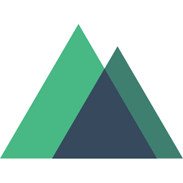

# Hi there, I'm Grigory 👋

## and I'm a web developer!

- 🌱 Learn something new every day
- ✔️ Make quality websites
- 📞 Contact me for cooperation

### Connect with me:

[][linkedin]
[][telegram]
[][vk]

 

### Languages and Tools:

                                 

 
 

[linkedin]: https://www.linkedin.com/in/grigory-morgachev-706610219/
[telegram]: https://t.me/gr1nmorg
[vk]: https://vk.com/gr1nmorg
